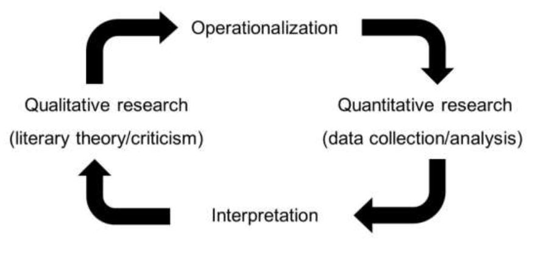

# Operationalization: the translation from a theoretical to an empirical level

## Moretti's paper (2013)

Moretti, Franco (2013): “«Operationalizing». Or, the Function of Measurement in Literary Theory”, _New Left Review_, 84, pp. 103-119.

- Short term origin (physics, the concept of length).
- Definitions.
- Example of operationalizing a literary concept: character-space. 
- Example of operationalization: tragedy.

### Definitions:

> "the operational approach refers specifically to concepts", 103 

> "it describes the process whereby concepts are transformed into a series of operations - which, in their turn, allow to measure all sorts of objects. Operationalizing means building a bridge from concepts to measurement, and then to the world. In our case: from the concepts of literary theory, through some form of quantification, to literary texts.", 104 

> "by following a series of steps, you can turn abstractions into a clear and, hopefully, unexpected elaboration of reality.", 108

To be able to use digital quantitative methods, it is necessary to convert a literary concept into a quantifiable unit,  however: "most literary concepts are emphatically _not_ designed to be quantified" (Moretti 2013, 114)

### Example of operationalizing a literary concept: 

Character-space by Woloch: the space of the character within the narrative structure;  Alex Woloch coined for his typology of major and minor characters in fiction (~ Structuralism).

- How to do it
    - "instrumental variables" as indirect features, e.g. counting character name mentions ~ space (G. Sack)
    - Counting: words, lines, pages (Moretti). Easy in drama "word-space: the number of words allocated to a particular character, by counting the words each character utters, we can determine how much textual space it occupies.", 105
    - Counting links: links between characters + weighted links (number of words exchange) + direction of links.
- Counting words: disappointment? 
    - "It adds detail, but it doesn't change what we already knew.", 108  Racine's *Phèdre*, nº of  words.
    - Volume of words vs and the number of interactions in *Phèdre* (vs Theseus), *Macbeth* (similar), *Othello* (vs Iago), *Don Carlos* (vs Posa), *Antigone* (vs Creon): centrality, protagonism, ... mediation
    - "That's why, in the end, its operationalization produced more than the refinement of already-existing knowledge: not the protagonist, improved, but an altogether new set of categories", 113. In Moretti's terms: utensil (amplified knowledge) vs instrument (unknown)	
- Example of operationalization: tragedy by Hegel (conflict and dialogue)
    - "most literary concepts are emphatically not designed to be quantified" (Moretti 2013, 114)
    - Distinctive words in characters in the play: conflict between state and family
    - Distinctive words in characters in the dialogue btw Antigone and Creon.

## Final remarks

- Other ways (in the steps) to operationalization
- How do we compare and evaluate operationalizations?
- Do we need to start from a literary concept?

"Instead of measuring things, finding patterns, and then finally asking what they mean, we need to start with an interpretive hypothesis (a "meaning" to investigate) and invent a way to test it." Underwood, 2019, 17

In short:

Image source: Salgaro 2018, 55.

## Further readings 

Commented examples of operationalizations:

Late Style, Authorship Attribution, Literary Movement (Salgaro, 2018); Urban space in science fiction,  Nietzsche's Moral Psychology, Strangeness Detection in Science fiction, Fictionality Detection: fiction vs non-fiction (Pichler, Reiter, 2022) 

Pichler, Axel, y Nils Reiter (2022): "From Concepts to Texts and Back: Operationalization as a Core Activity of Digital Humanities", *Journal of Cultural Analytics*, 7, 4, <https://doi.org/10.22148/001c.57195>.

Salgaro, Massimo (2018): "The Digital Humanities as a Toolkit for Literary Theory: Three Case Studies of the Operationalization of the Concepts of "Late Style," "Authorship Attribution," and "Literary Movement"", *Iperstoria*, 12 <https://doi.org/10.13136/2281-4582/2018.I12.395>.