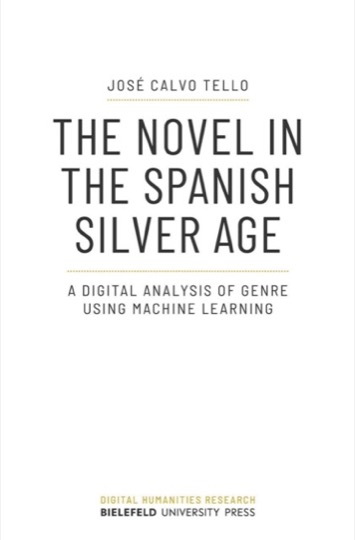

# Distant Reading and Computational Literary Studies

Internal lecture at RISE

- _Sphären der Digital Humanities_
- _Digitale Literaturwissenschaft_
- Corpora
- Stylometry
- Text reuse
- Data Viz (GIS, networks)
- Distant reading

## _Sphären der Digital Humanities_

Sahle (2013: 6)

- Sahle's three realms: _Referenzcurriculum_ for DH
- _Digital Humanities pur_: 
> Die Digital Humanities liefern zwar grundlegende Lösungsansätze für Forschungsfragen der geisteswissenschaftlichen Fächer, sind aber nicht auf diese konkreten Fragen beschränkt, sondern fokussieren auf allgemeine Grundlagen und übertragbare Lösungen.
- _Digital [Fach X]_:
> Hier lassen sich die Digital Humanities als Summe von alten und neuen Disziplinen beschreiben, die selbst wieder durch digitale Medien und Methoden verändert worden sind.
- _[Fach X] mit Digital Humanities_:
> Digitale Methoden sind dann Teil traditioneller Fächer und erweitern den Methodenkanon und das Set der verfügbaren Werkzeuge.

##  _Digitale Literaturwissenschaft_

Digital Literary Studies, Literary Computing, Computational Literary Studies

**Digital and/or statistical component; computational**:
- **Authors and writing**: Stylometry (how to recognize computationally the literaty style in a text); intertextuality, text-reuse (literary, historical, modern texts);  sentiment analysis. 
- **Space**: literary space, geographical features in texts (GIS), literary/historical maps;
- **Visualization**: data visualization; network analysis (iterary characters, metadata, stylometry): visual and mathematical approaches (metrics);
- **Distant analysis**: historical evolution of genre; literary canon.

☞ Statistics:

- Descriptive Statistics (general view about content and tendencies).
- Inferential Statistics (to generalize from sample data to population characteristics).
- Machine learning (classification, ...)

### Distant Reading

- The unit of analysis is not only a few texts (close reading), but a large quantitative dataset.
- To gain a wider perspective.
- To focus on very broad units to reveal their overall interconnections, structures, patterns, etc.
- Macroanalysis and microanalysis: text disappears as an interpretative unit.

(Jockers 2013. _Macroanalysis: Digital Methods and Literary History_)

**Franco Moretti and the Stanford Literary Lab.**

- [Pamphlets](https://litlab.stanford.edu/pamphlets/): well documented experiments and projects on literary DH (2011-2018; to date: 17).

- [11. Canon/Archive. Large-scale Dynamics in the Literary Field (2016)](https://litlab.stanford.edu/LiteraryLabPamphlet11.pdf)
    
> Of the novelties introduced by digitization in the study of literature, the size of the archive is probably the most dramatic: we used to work on a couple of hundred nineteenth-century novels, and now we can analyze thousands of them, tens of thousands, tomorrow **hundreds of thousands**. It’s a moment of euphoria, for quantitative literary history: like having a **telescope** that makes you see entirely new galaxies.

- [6. “Operationalizing”: Or, the function of measurement in modern literary theory](https://litlab.stanford.edu/LiteraryLabPamphlet6.pdf)
    
> "most literary concepts are emphatically not designed to be quantified" (Moretti 2013: 114).

To be able to use digital quantitative methods, it is necessary to convert a literary concept into a quantifiable unit. 

☞ protagonist

**Graphs, Maps and Trees**

The three elements are each ways of spatializing numerical data. Moretti (2007): A work that adds the visual component to the analysis of distant reading.

**Distant vs close reading** 

- “digital methods can bring us _closer_ to literary texts” (Eve, 2022: 4)
- "digital practices require validation on the micro level in order to scale” (Eve, 2022: 21)

## Corpora creation

- Literary corpus preparation (OCR, HCR, Copywriting ☞ common issues for DH).
- Corpora Rationale: representativeness (balanced), authenticity, and size (_mo’better_).

Example ☞ Distant Reading for European Literary History (COST Action, 2017-2022).

1200 texts in 17 languages ☞ [European Literary Text Collection (ELTeC)](https://github.com/COST-ELTeC)(Github and Zenodo).

Criteria (granularity ↓)
- Level 0: Plain text
- Level 1: Encoding (XML-TEI)
- Level 2: Annotation (Lemmata and PoS)

XML validated with corresponding schemas; scripts for manipulation and transformation available (xslt, python): 

- XML/TEI has a common ground with [Digital Scholarly Editions](https://dig-ed-cat.acdh.oeaw.ac.at), with text collections: [Deutsches Textarchiv](https://www.deutschestextarchiv.de), but more restricted XML/TEI, corpora rationale for research.

- Common ground with Corpus linguistics. Similar annotations using NLP: PoS, lemmatization, parsing (syntactic analysis); corpora rationale.

(Schöch 2022)

## Stylometry

- Digital Literary Stylistics [(Author attribution), (Sentiment Analysis), (Genre distinction)...] 
- **Author attribution** asumes that there is such a thing as each author's stylistic _fingerprint_, i.e. measurable (or detectable) unitary features of language.
- Content words vs. function words.
- Parameters: 
    - features: MFW (More Frequent Words), PoS, ngrams
    - statistics: Cluster Analysis, Consensus trees
    - distances: delta, manhattan, etc.
    - classifiers.
- Popularization thanks to `stylo()`, a package in R, but possible with other programming languages.

- Unsupervised (no training data) / Supervised (training data) Machine Learning

## Text reuse

- Information retrieval: known vs. unknown (source in target; sources as targets)
- Tracer, passim, textreuse
    - Featuring: words, n-grams 
    - Selection: function words, ...
    - Linking: intern/extern
    - Scoring: % = _reuse_

- Parallel visualization, collation,...

## Data Viz

### Literary GIS

- [Digital mapping of Literature](https://editio.github.io/mapping.literature)

### Network analysis 

- [Dracor](https://dracor.org): co-occurrence networks of characters.
- Centrality metrics, eigenvector, betweenness, etc.
- [Showcase of networks](https://github.com/editio/dataviz_gephi#showcase)
- [Paratexts](https://editio.github.io/grafos/paratextos/)

## Distant reading

Underwood (2019): _Distant Horizons: Digital Evidence and Literary Change_

- Various hypotheses about the historical development of genres (gothic, science fiction and crime)

> One of the central arguments of this book is that contemporary quantitative methods can be very good at representing perspectival problems and can give us leverage on that dimension of history.

- Against the idea of science fiction as a product of market forces: it is indeed a textual construct, inherent in the work itself

- Large corpus, 2 centuries span, HathiTrust Digital Library, annotated manually, supervised model.

Calvo Tello, José (2021): _The Novel in the Spanish Silver Age: A Digital Analysis of Genre Using Machine Learning_

- new corpus of 358 Spanish novels (1880-1939), TEI/XML [CoNSSA](https://github.com/cligs/conssa)

> Each text has been encoded in XML-TEI and enriched with several types of metadata (administrative, genre labels, literary information about the plot, etc.). Each file is also offered linguistically annotated with morphological, syntactic, semantic, and textual layers, including the difference between narrative direct speech passages.

- Validation of metadata for genre (novel) and subgenre (historical novel, ...)

## References

Calvo Tello, José (2021): _The Novel in the Spanish Silver Age: A Digital Analysis of Genre Using Machine Learning_, Bielefeld, transcript Verlag / Bielefeld University Press, <https://doi.org/10.14361/9783839459256>.

Eve, Martin Paul (2022): _The digital humanities and literary studies_, Oxford, Oxford University Press.

Moretti, Franco (2013): _Distant reading_, London; New York, Verso.

Moretti, Franco (2007): _Graphs, Maps and Trees. Abstract Models for Literary History_, 2.ª ed., London, Verso.

Sahle, Patrick (2013): “DH studieren! Auf dem Weg zu einem Kern- und Referenzcurriculum der Digital Humanities”, in DARIAH-DE Working Papers, Göttingen, DARIAH-DE, <http://webdoc.sub.gwdg.de/pub/mon/dariah-de/dwp-2013-1.pdf>.

Schöch, Christof (2022), "Do Sentences in Novels Get Shorter over the Course of the Nineteenth Century?", _The Dragonfly's Gaze. Computational analysis of literary texts_, Hypotheses, <https://dragonfly.hypotheses.org/1152>

Underwood, Ted (2019), _Distant Horizons: Digital Evidence and Literary Change_, Chicago, The University of Chicago Press.
